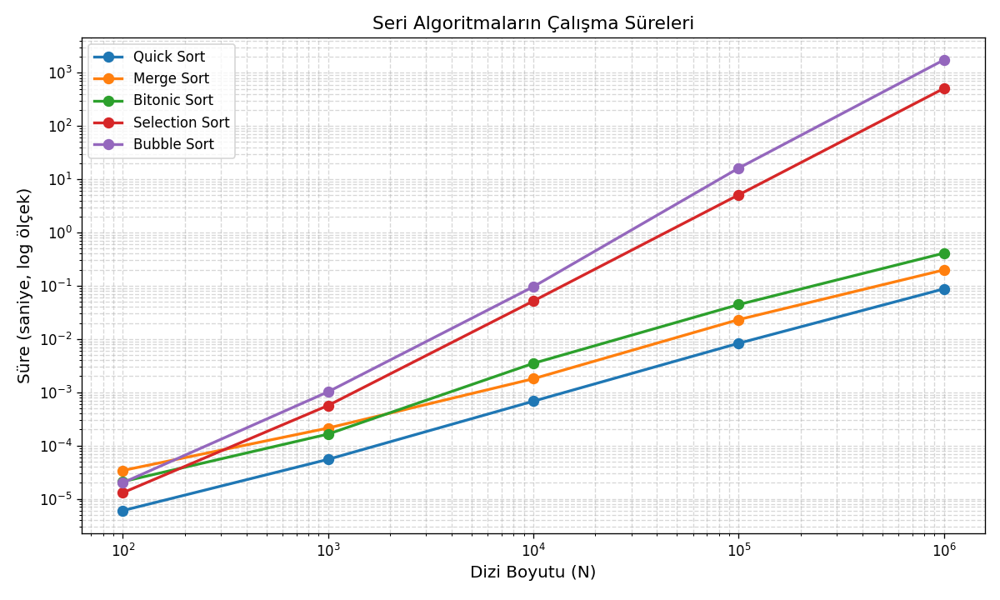
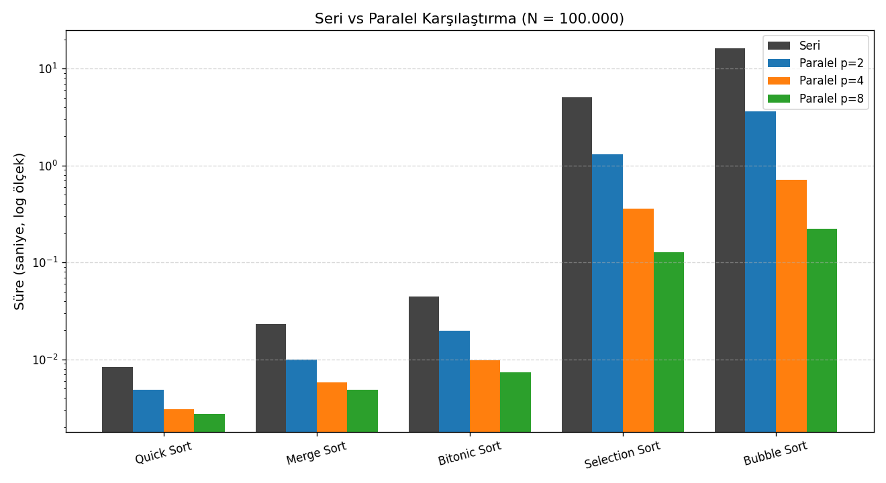
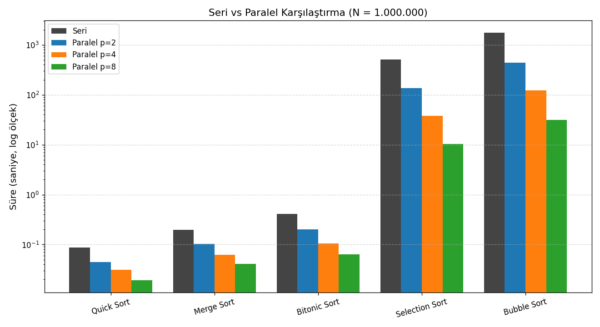
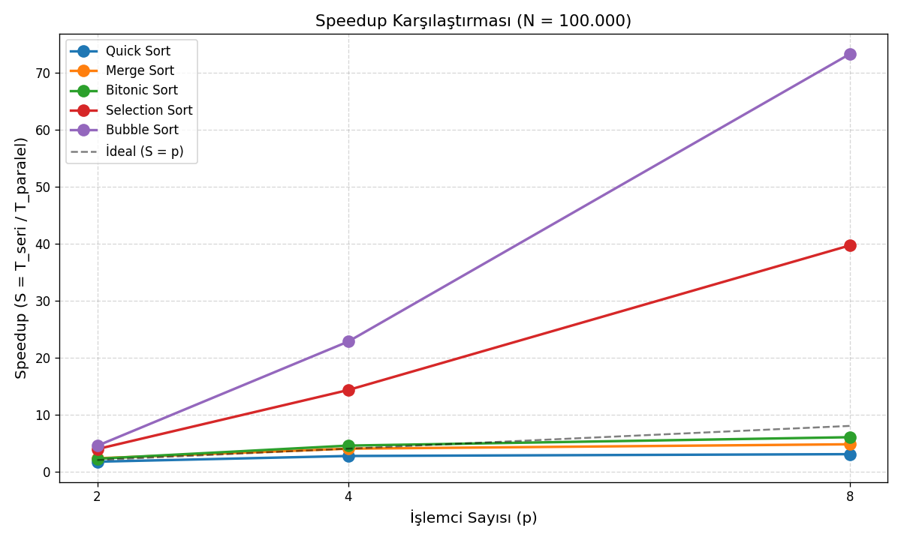
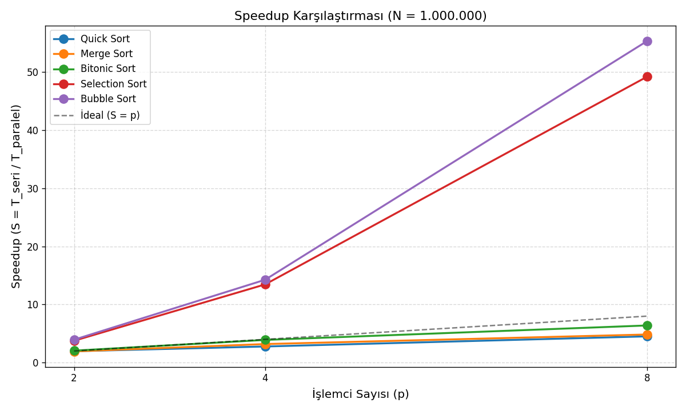

# Paralel Hesaplama Ödevi — Sıralama Algoritmaları Raporu

## Sistem Özellikleri

| Bileşen | Değer |
|---|---|
| İşlemci | AMD Ryzen 7 7735HS (8 çekirdek / 16 iş parçacığı), 3.6 GHz |
| RAM | 16 GB DDR5 2400 MHz Quad Channel |
| İşletim Sistemi | Windows 10 Pro 22H2 |
| Derleyici | MinGW GCC |
| MPI | Microsoft MPI (msmpi) |
| Standart | C17 |

## İçindekiler

- [Temel Kavramlar](#temel-kavramlar)
- [Bölüm 1 — Seri Sıralama Algoritmaları](#bölüm-1--seri-sıralama-algoritmaları)
  - [1.1 Teorik Anlatım](#11-teorik-anlatım)
  - [1.2 Hesaplama Denemeleri](#12-hesaplama-denemeleri)
- [Bölüm 2 — Algoritmaların Paralel Versiyonları (MPI)](#bölüm-2--algoritmaların-paralel-versiyonları-mpi)
  - [2.1 Paralel Tasarım ve Teorik Anlatım](#21-paralel-tasarım-ve-teorik-anlatım)
  - [2.2 Hesaplama Denemeleri](#22-hesaplama-denemeleri)
  - [2.3 Speedup ve Verimlilik](#23-speedup-ve-verimlilik)
  - [2.4 Algoritma Bazında Paralel Verim Yorumu](#24-algoritma-bazında-paralel-verim-yorumu)
  - [2.5 Darboğaz Analizi](#25-darboğaz-analizi)

---

### Speedup ve Verimlilik

Paralel bir algoritmanın ne kadar işe yaradığını iki sayıyla ölçüyoruz:

**Speedup (Hızlanma):**
```
S(p) = T_seri / T_paralel(p)
```
Seri kodun süresini, p çekirdekle çalışan paralel kodun süresine böleriz. Örneğin S = 4 demek paralel kod seri koddan 4 kat hızlı demektir.

**Verimlilik (Efficiency):**
```
E(p) = S(p) / p
```
Speedup'ı işlemci sayısına böleriz. Her çekirdeğin ne kadar verimli kullanıldığını gösterir. İdeal değer **E = 1.0**'dır (her çekirdek yüzde yüz çalışıyor). E = 0.5 demek çekirdeklerin ortalama yarısı boşa oturuyor demektir. Bazen (özel durumlarda) E > 1 çıkabilir ve buna **süper-lineer speedup** denir — ileride inceleyeceğiz.

Uygulamada E = 1.0'a ulaşmak neredeyse imkânsızdır çünkü paralelleştirme haberleşme ve yönetim gibi ekstra maliyetler getirir. E = 0.7 – 0.9 arası genelde "iyi paralelleşme" sayılır.

---

## Bölüm 1 — Seri Sıralama Algoritmaları

### 1.1 Teorik Anlatım

#### Quick Sort

Böl-yönet (divide-and-conquer) yaklaşımını kullanır. Diziden bir pivot seçilir, pivottan küçük elemanlar sola, büyük elemanlar sağa gelecek biçimde bölümlenir; sonra iki yarı özyinelemeli olarak aynı şekilde sıralanır.

- **Ortalama karmaşıklık:** O(n log n)
- **En kötü durum**  O(n²)

#### Merge Sort

Yine bir böl-yönet algoritmasıdır. Dizi ortadan iki eşit parçaya bölünür, her parça özyinelemeli olarak sıralanır, ardından iki sıralı parça tek bir sıralı dizide birleştirilir.

- **Tüm durumlarda:** O(n log n) — en iyi/ortalama/en kötü aynı

#### Bitonic Sort

Bitonic sort, diziyi önceden belirlenmiş sabit bir desene göre karşılaştırıp yer değiştirerek sıralayan bir algoritmadır. Hangi elemanın hangi elemanla karşılaştırılacağı giriş verisine bağlı değildir; karşılaştırma sırası baştan bellidir. Bu yüzden aynı anda birçok karşılaştırma paralel yapılabilir ve paralelleştirmesi kolaydır.

Çalışabilmesi için dizinin boyutunun 2'nin kuvveti olması gerekir (8, 16, 32, 64 gibi). Eğer değilse, dizinin sonuna `INT_MAX` (yani çok büyük bir sayı) eklenerek boyut 2'nin kuvvetine tamamlanır. Sıralama bittikten sonra bu fazla elemanlar atılır — gerçek sonucu bozmazlar çünkü hepsi dizinin sonunda birikirler.

- **Tüm durumlarda:** O(n log² n)

#### Selection Sort

Her iterasyonda dizinin sıralanmamış bölümünden en küçük elemanı bulup mevcut konuma yerleştirir.

- **Tüm durumlarda:** O(n²)

#### Bubble Sort

Komşu elemanları ikili karşılaştırıp ters sıradalarsa yer değiştirir. Her geçişte en büyük eleman dizinin sonuna doğru itilir ve en sona yerleşir. Bir sonraki geçişte ikinci en büyük eleman sondan bir önceki konuma gelir, bu şekilde dizi yavaş yavaş sıralanır.

- **En iyi durum** O(n)
- **Ortalama ve en kötü:** O(n²)

### 1.2 Hesaplama Denemeleri

Ölçümler `gettimeofday()` tabanlı mikro-saniye hassasiyetindeki `get_time()` fonksiyonu ile yapılmıştır. Veri seti `rand() % 1000000` ile üretilen 0 ve 1 milyon arasındaki rastgele tam sayılardır. Her algoritma için `copy_array` fonksiyonu ile dizinin orijinali korunarak kopyası üzerinde sıralama yapılır . Sonuç her çalıştırmada `is_sorted()` ile doğrulanır.

**Tablo 1.1 — Seri çalışma süreleri (saniye)**

| N | Quick Sort | Merge Sort | Bitonic Sort | Selection Sort | Bubble Sort |
|---:|---:|---:|---:|---:|---:|
| 100 | 0.000006 | 0.000034 | 0.000021 | 0.000013 | 0.000020 |
| 1.000 | 0.000055 | 0.000213 | 0.000164 | 0.000565 | 0.001021 |
| 10.000 | 0.000680 | 0.001796 | 0.003498 | 0.051797 | 0.096148 |
| 100.000 | 0.008325 | 0.023166 | 0.044366 | 5.101403 | 16.212982 |
| 1.000.000 | 0.087513 | 0.198633 | 0.410216 | 508.595415 | 1748.750755 |



**Performans sıralaması (en hızlıdan en yavaşa, N = 100.000):**

1. Quick Sort — 0.0083 s
2. Merge Sort — 0.0232 s
3. Bitonic Sort — 0.0444 s
4. Selection Sort — 5.1014 s
5. Bubble Sort — 16.2130 s

**Teorik karmaşıklık ile uygulama ilişkisi:**

Aşağıdaki tabloda dizi boyutu 10 kat arttığında sürenin gerçekte kaç kat arttığı, teorik beklentiyle yan yana gösterilmektedir.

| Algoritma | Teorik | 10K → 100K (gerçek) | 100K → 1M (gerçek) | Beklenen (O notasyonuna göre) |
|---|---|---|---|---|
| Quick Sort | O(n log n) | 0.00068 → 0.00833 = 12× | 0.00833 → 0.08751 = 10.5× | ≈12-14× |
| Merge Sort | O(n log n) | 0.00180 → 0.02317 = 13× | 0.02317 → 0.19863 = 8.6× | ≈12-14× |
| Bitonic Sort | O(n log² n) | 0.00350 → 0.04437 = 13× | 0.04437 → 0.41022 = 9.2× | ≈13-15× |
| Selection Sort | O(n²) | 0.05180 → 5.10140 = 98× | 5.10140 → 508.595 = 99.7× | ≈100× |
| Bubble Sort | O(n²) | 0.09615 → 16.2130 = 169× | 16.2130 → 1748.75 = 107.9× | ≈100× |

Tabloya genel olarak bakıldığında, algoritmaların gerçek çalışma süreleri teorik karmaşıklık tahminleriyle oldukça iyi uyum gösteriyor. Quick, Merge ve Bitonic sort gibi O(n log n) karmaşıklığa sahip algoritmalarda dizi boyutu 10 kat arttığında süre yaklaşık 12-13 kat artıyor. Bu beklenen bir sonuçtur çünkü `n log n` fonksiyonu `n` büyüdükçe neredeyse doğrusal gibi davranır: `log n` çok yavaş büyüyen bir fonksiyondur. Örneğin 10.000 için `log₂(10000) ≈ 13`, 100.000 için `log₂(100000) ≈ 17` — aralarında yalnızca 1.3 katlık bir fark var. Yani `n log n`'in artışı büyük ölçüde `n`'den gelir.

Selection sort için 10.000 → 100.000 geçişinde süre 98 kat arttı. Teorik beklenti O(n²) için tam 100 kat; gerçek ölçüm bu beklentiye neredeyse birebir uyuyor. Bunun sebebi Selection sort'un davranışının giriş verisine bağlı olmaması: dizi ister sıralı ister ters sıralı, ister rastgele olsun, her zaman aynı sayıda karşılaştırma yapar (tam olarak `n·(n−1)/2`). Bu yüzden süre tahmini çok kararlıdır.

Bubble sort için ise süre 169 kat arttı — yani beklenen 100 katın belirgin şekilde üzerinde. Bunun birden çok sebebi var:

- **Erken çıkış optimizasyonu pratikte işe yaramıyor.** Kodumuzda "bir geçişte hiç swap olmazsa döngüyü kır" optimizasyonu var. Ama rastgele üretilmiş büyük bir dizide neredeyse her geçişte en az bir swap olur, bu yüzden döngü sonuna kadar dönmek zorunda kalır. Optimizasyon pratikte çalışmıyor, teorik en iyi durum (O(n)) oluşmuyor.
- **Swap sayısı çok yüksek.** Rastgele bir dizide beklenen swap sayısı yaklaşık `n²/4`. `n` 10 kat büyüdüğünde swap sayısı 100 kat artar. Ancak her swap bellek yazması demektir ve bu yazma işlemleri sabit ama küçümsenemeyecek bir maliyet taşır.
- **Cache etkisi.** Bubble sort sürekli komşu elemanlara erişir. Küçük `n` için dizi tamamen CPU cache'ine sığar ve her işlem hızlıdır. Büyük `n`'de (100.000 int = 400 KB) dizi L2 cache'ini aşar, bazı erişimler için RAM'den okuma yapılmak zorunda kalınır. RAM erişimi cache erişiminden ~100 kat yavaş olduğu için toplam süre teoriye göre daha fazla artar.

Sonuç olarak Quick sort pratikte en hızlı algoritma çıktı. Merge sort'tan bile yaklaşık 3 kat hızlı — bunun sebebi Quick sort'un cache-friendly olması (verileri yerinde bölümlüyor, ekstra bellek tahsisi yapmıyor) ve sabit faktörünün küçük olmasıdır. Selection ve Bubble sort ise 100.000 gibi orta büyüklükte bir dizide bile saniyeler sürüyor; 1.000.000 elemanda dakikalar alacakları önceden tahmin edilebilir ve bu algoritmalar büyük veri için pratik olarak kullanılamazlar.

---

## Bölüm 2 — Algoritmaların Paralel Versiyonları (MPI)

### 2.1 Paralel Tasarım ve Teorik Anlatım

Paralel uygulama **tree-based merge** (ağaç tabanlı birleştirme) yaklaşımıyla gerçekleştirilmiştir (`run_parallel_sort_tree`). Algoritma akışı:

1. **Dağıtım (Scatter):** Rank 0 elinde bulunan N elemanlı diziyi `MPI_Scatter` ile p eşit parçaya böler ve her rank'e kendi payına düşen parçayı gönderir. Her rank `n/p` elemanlık küçük bir dizi alır. Örneğin N = 1.000.000 ve p = 8 ise her rank 125.000 elemanlık bir parça alır.

2. **Yerel sıralama:** Her rank, kendi payına düşen küçük diziyi kendi başına seri sıralama algoritmasıyla (quick sort, merge sort, vb.) sıralar. Bu adımda ranklar arasında hiçbir haberleşme yoktur; hepsi aynı anda, birbirinden bağımsız çalışır. Bu sayede toplam sıralama işi p kat (kabaca) azalır. Özellikle O(n²) algoritmalarda — her rank `(n/p)²` iş yaptığı için — toplam iş p² kat azalır, bu yüzden Selection/Bubble sort paralel versiyonları süper-lineer hızlanma gösterir (bunu birazdan detaylı inceleyeceğiz).

3. **Ağaç merge (birleştirme aşaması):** Artık her rank'in elinde küçük ama sıralı bir dizi var. Bu parçaları tek bir büyük sıralı dizide birleştirmemiz gerekiyor. Bunu rank 0'a hepsini gönderip orada tek başına yapmak yerine, ranklar arasında paralel olarak, ağaç şeklinde birleştiriyoruz. Ağaç merge `log₂(p)` aşamadan oluşur (p = 8 için 3 aşama). Her aşamada rank'lerin yarısı "gönderici" yarısı "alıcı" olur:

   - **Gönderici rank** kendi sıralı dizisini ve uzunluğunu komşu rank'e gönderir, sonra işini bırakır (bir daha bu algoritma için çalışmaz).
   - **Alıcı rank** kendi sıralı dizisiyle gelen sıralı diziyi iki-imleçli klasik merge yöntemiyle birleştirir. Elinde iki katı büyüklükte, yine sıralı yeni bir dizi olur.

   p = 8 için aşamalar şöyle ilerler:
   - **Aşama 1** (step = 1): 1→0, 3→2, 5→4, 7→6. Dört merge paralel çalışır. Sonuçta aktif rank sayısı 4'e düşer (0, 2, 4, 6). Her biri `2n/p` elemanlık sıralı parçaya sahiptir.
   - **Aşama 2** (step = 2): 2→0, 6→4. İki merge paralel çalışır. Aktif rank sayısı 2'ye düşer (0, 4). Her biri `4n/p` elemanlık sıralı parçaya sahiptir.
   - **Aşama 3** (step = 4): 4→0. Son merge çalışır. Rank 0'da `n` elemanlı tamamen sıralı dizi oluşur.

4. **Doğrulama:** Son sıralı dizi rank 0'da birikir. `is_sorted()` ile dizinin gerçekten sıralı olup olmadığı kontrol edilir ve ekrana `Sorted: YES` basılır.

**Zaman ölçümü:** Her algoritma için `MPI_Wtime()` ile lokal süre ölçülür ve `MPI_Reduce(MPI_MAX)` ile en yavaş rank'ın süresi raporlanır. Her ölçümden önce `MPI_Barrier` ile senkron nokta vardır.

**Ağaç merge neden iteratif merge'den iyidir?**

İlk yazdığımız paralel kodda merge işlemi daha basit bir yöntemle yapılıyordu: tüm ranklar kendi sıralı parçalarını `MPI_Gather` ile rank 0'a gönderiyor, rank 0 bu parçaları birer birer mevcut sıralı diziye ekleyerek merge ediyordu. Buna **iteratif (lineer) merge** denir. Bu yöntemin sorunları şunlar:

- Merge işleminin **tamamı rank 0'da** yapılır, diğer p−1 rank merge boyunca bekler (boşa oturur).
- Rank 0 her adımda büyüyen dizinin tümünü baştan okumak zorundadır. Her eklemede sıralı kısım `n/p`, `2n/p`, `3n/p`, … kadar büyür. Toplamda rank 0 kabaca `n/p + 2n/p + … + n = O(n·p)` iş yapar (aslında O(n²/p)·(p-1) gibi).
- Sonuç: merge aşaması p arttıkça **daha da yavaşlar**, paralel kazanç erime eğilimine girer.

**Ağaç merge** ise işi şu şekilde dağıtır:

- **Aşama 1**'de p/2 merge paralel çalışır; her biri `2n/p` eleman işler. Toplam iş p/2 × 2n/p = n; ama paralel çalıştığı için **geçen süre sadece bir merge kadar**, yani O(n/p).
- **Aşama 2**'de p/4 merge paralel çalışır; her biri `4n/p` eleman işler. Geçen süre O(2n/p).
- Son aşamada 1 merge `n` eleman işler. Geçen süre O(n/2).

Paralel sürelerin toplamı: `n/p + 2n/p + 4n/p + … + n/2 ≈ 2n`, yani **O(n)**. Bu "geçen toplam süre"ye **kritik yol** denir.

**Kritik yol ne demek?** Paralel bir hesaplamada, bir işlem öncekinin bitmesini bekliyorsa aralarında bir bağımlılık vardır. Kritik yol, bu bağımlı işlemlerden en uzun olan zincirdir — ne kadar çekirdek eklesen bu zinciri kısaltamazsın, çünkü işler sırayla yapılmak zorunda. Ağaç merge'de kritik yol O(n) iken iteratif merge'de O(n·p). p = 8 için bu teoride **8 kat potansiyel hızlanma** demek.

**Teorik toplam maliyet nasıl çıkarılır?**

Paralel bir algoritmanın toplam süresi, yukarıdaki adımların sürelerinin toplamıdır. Her adım için ayrı ayrı hesaplayıp topluyoruz:

```
T_parallel(n, p) = O((n/p) · log(n/p))   [yerel sort, Quick/Merge/Bitonic için]
                 + O(n)                  [ağaç merge kritik yolu]
                 + O(n)                  [Scatter ile veri dağıtımı]
                 + O(log p · latency)    [mesaj gönderim gecikmeleri]
```

Her terimin anlamı:

- **Yerel sort — O((n/p) · log(n/p)):** Her rank kendi `n/p` elemanlık parçası üzerinde O(m log m) karmaşıklığa sahip bir sıralama çalıştırır (Quick/Merge/Bitonic için). Burada `m = n/p`, yani ifade `(n/p) · log(n/p)` olur. `p` büyüdükçe bu terim küçülür — paralelleştirmenin en büyük kazancı buradan gelir.
- **Ağaç merge kritik yolu — O(n):** Yukarıda açıkladığımız gibi, `log₂(p)` aşama boyunca yapılan paralel merge'lerin toplam süresi O(n)'e yakınsar.
- **Scatter — O(n):** Rank 0 diziyi dağıtırken toplam `n` elemanı ağa bir kere yollar. Bu doğrudan bir O(n) maliyettir ve `p`'den bağımsızdır.
- **İletişim gecikmesi — O(log p · latency):** Her MPI mesajının sabit bir başlangıç gecikmesi vardır (mikro-saniye mertebesinde, tipik olarak 1-10 μs). Ağaç merge'de `log₂(p)` aşama olduğu için bu gecikme kadar kez ödenir. `n`'den bağımsız ama `p`'ye bağlıdır.

Hangi terimin baskın olduğu `n` ve `p`'ye bağlıdır: küçük `n`'de iletişim gecikmesi ve scatter baskındır (paralelleştirme işe yaramaz), büyük `n`'de yerel sort ve ağaç merge baskındır (paralelleştirme kazançlı).

### 2.2 Hesaplama Denemeleri

**Tablo 2.1 — Paralel süreler (saniye), p = 2**

| N | Quick | Merge | Bitonic | Selection | Bubble |
|---:|---:|---:|---:|---:|---:|
| 100 | 0.000028 | 0.000025 | 0.000036 | 0.000021 | 0.000021 |
| 1.000 | 0.000060 | 0.000114 | 0.000092 | 0.000164 | 0.000393 |
| 10.000 | 0.000432 | 0.000926 | 0.001691 | 0.013079 | 0.026534 |
| 100.000 | 0.004863 | 0.010021 | 0.019888 | 1.299180 | 3.597136 |
| 1.000.000 | 0.044705 | 0.103062 | 0.199577 | 135.270050 | 443.663357 |

**Tablo 2.2 — Paralel süreler (saniye), p = 4**

| N | Quick | Merge | Bitonic | Selection | Bubble |
|---:|---:|---:|---:|---:|---:|
| 100 | 0.000106 | 0.000025 | 0.000008 | 0.000009 | 0.000005 |
| 1.000 | 0.000149 | 0.000093 | 0.000057 | 0.000074 | 0.000118 |
| 10.000 | 0.000487 | 0.000767 | 0.001100 | 0.003522 | 0.010319 |
| 100.000 | 0.003067 | 0.005789 | 0.009780 | 0.356710 | 0.710691 |
| 1.000.000 | 0.031562 | 0.062203 | 0.105127 | 37.801512 | 122.664615 |

**Tablo 2.3 — Paralel süreler (saniye), p = 8**

| N | Quick | Merge | Bitonic | Selection | Bubble |
|---:|---:|---:|---:|---:|---:|
| 100 | — | — | — | — | — |
| 1.000 | 0.000209 | 0.000082 | 0.000043 | 0.000048 | 0.000049 |
| 10.000 | 0.000515 | 0.000663 | 0.000702 | 0.001804 | 0.002963 |
| 100.000 | 0.002743 | 0.004853 | 0.007375 | 0.128437 | 0.221019 |
| 1.000.000 | 0.019372 | 0.041054 | 0.064166 | 10.333895 | 31.593845 |

> **Not:** N = 100 için p = 8 testi yapılamamıştır çünkü kodumuz N'nin p'ye tam bölünmesini gerektirir (`100 / 8 = 12.5`, tamsayı değil) ve `parallel_main` bu durumda hata dönüp ölçüm yapmaz.





### 2.3 Speedup ve Verimlilik

Speedup formülü: **S(p) = T_seri / T_paralel(p)**

Verimlilik formülü: **E(p) = S(p) / p**

**Tablo 2.4 — Speedup ve verimlilik (N = 100.000, T_seri baz alınarak)**

| Algoritma | T_seri | T(p=2) | S(2) | E(2) | T(p=4) | S(4) | E(4) | T(p=8) | S(8) | E(8) |
|---|---:|---:|---:|---:|---:|---:|---:|---:|---:|---:|
| Quick Sort | 0.00833 | 0.00486 | 1.71 | 0.86 | 0.00307 | 2.71 | 0.68 | 0.00274 | 3.03 | 0.38 |
| Merge Sort | 0.02317 | 0.01002 | 2.31 | 1.16 | 0.00579 | 4.00 | 1.00 | 0.00485 | 4.77 | 0.60 |
| Bitonic Sort | 0.04437 | 0.01989 | 2.23 | 1.12 | 0.00978 | 4.54 | 1.13 | 0.00738 | 6.02 | 0.75 |
| Selection Sort | 5.10140 | 1.29918 | 3.93 | 1.96 | 0.35671 | 14.30 | 3.57 | 0.12844 | 39.72 | 4.96 |
| Bubble Sort | 16.21298 | 3.59714 | 4.51 | 2.25 | 0.71069 | 22.81 | 5.70 | 0.22102 | 73.36 | 9.17 |



**Tablo 2.5 — Speedup ve verimlilik (N = 1.000.000)**

| Algoritma | T_seri | T(p=2) | S(2) | E(2) | T(p=4) | S(4) | E(4) | T(p=8) | S(8) | E(8) |
|---|---:|---:|---:|---:|---:|---:|---:|---:|---:|---:|
| Quick Sort | 0.08751 | 0.04471 | 1.96 | 0.98 | 0.03156 | 2.77 | 0.69 | 0.01937 | 4.52 | 0.57 |
| Merge Sort | 0.19863 | 0.10306 | 1.93 | 0.96 | 0.06220 | 3.19 | 0.80 | 0.04105 | 4.84 | 0.60 |
| Bitonic Sort | 0.41022 | 0.19958 | 2.06 | 1.03 | 0.10513 | 3.90 | 0.98 | 0.06417 | 6.39 | 0.80 |
| Selection Sort | 508.59542 | 135.27005 | 3.76 | 1.88 | 37.80151 | 13.45 | 3.36 | 10.33390 | 49.22 | 6.15 |
| Bubble Sort | 1748.75076 | 443.66336 | 3.94 | 1.97 | 122.66462 | 14.26 | 3.56 | 31.59385 | 55.35 | 6.92 |



#### Süper-lineer speedup (S > p) hakkında önemli bir not

Speedup değerlerine dikkatli bakıldığında garip bir sonuç görülür: Selection ve Bubble sort için **speedup, işlemci sayısından büyük** çıkıyor. Örneğin Bubble sort p = 8'de 73 kat hızlandı. Mantıken 8 işlemci ile en fazla 8 kat hızlanabilmesi gerekirdi (ideal durumda bile). Nasıl olur?

**Neler oluyor bir hesaplayalım:**

O(n²) bir algoritma için seri çalıştırmada iş miktarı kabaca n × n / 2 olur. N = 100.000 için: 100.000 × 100.000 = **10 milyar** işlem.

Paralel versiyonda ise her rank kendi `n/p` elemanlık parçasını sıralar:
- p = 8, her rank'in parçası = 12.500 eleman
- Her rank: 12.500 × 12.500 = 156 milyon işlem
- 8 rank paralel çalışır → **toplam iş = 8 × 156 milyon = 1.25 milyar** işlem

Yani seri 10 milyar, paralel toplam iş 1.25 milyar. **Toplam iş miktarı 8 kat değil, 8² = 64 kat azaldı!**

Matematiksel olarak: seri O(n²), paralel p × (n/p)² = n²/p. İş p² kat değil, p kat azalıyor… ama paralel çalıştığı için geçen süre (n²/p) / p = n²/p² yani **p² kat** kısalıyor.

**Peki bu "adil" bir hızlanma mı?**

Değil. Paralel Bubble/Selection sort aslında seri Bubble/Selection sort'un paralel versiyonu değil, **farklı bir algoritma**. Çünkü:
- Seri versiyon: 100.000 elemanı tek bir bubble sort ile sıralar.
- Paralel versiyon: 8 ayrı küçük bubble sort + bir merge. Merge kısmı bubble sort değil, doğrusal birleştirmedir.

Yani paralelleştirme hem işi böldü hem de algoritmanın kendisini değiştirdi. Süper-lineer hızlanmanın büyük kısmı **algoritmik iyileşmeden** geliyor, paralellikten değil.

**Hangi speedup'lar "gerçek" paralel kazancı gösterir?**

Quick sort, Merge sort ve Bitonic sort için speedup değerleri `p`'nin altında veya ona yakın (örn. p = 8 için 3× – 6×). Bunlar gerçek paralel kazancı gösterir çünkü bu algoritmaların karmaşıklığı O(n log n) ve paralelleştirme onların iş miktarını anlamlı biçimde değiştirmez. İş zaten verimli bir algoritmadır, onu 8 çekirdeğe bölersin, en fazla 8 kat hızlanır.

**Sonuç:** Selection/Bubble sort'un yüksek speedup'ları yanıltıcıdır. Gerçek dünyada "paralel bubble sort 73 kat hızlıdır" demek yanlıştır; doğrusu "10 milyarlık işi 1.25 milyara indiren algoritmik bir değişiklik yaptık" olur. Paralel sıralama tercih edilirken Quick/Merge/Bitonic gibi zaten verimli algoritmalar seçilmelidir.

### 2.4 Algoritma Bazında Paralel Verim Yorumu

Her algoritma için "paralelleştirmek işe yaradı mı?" sorusunu ayrı ayrı değerlendiriyoruz. Aşağıdaki yorumlar N = 1.000.000 verilerine dayanmaktadır (Tablo 2.5).

- **Quick Sort**: Seri hâli zaten hızlı (0.087 s) olduğu için MPI iletişim maliyetinin göreli ağırlığı yüksek. p = 8'de 4.52× hızlanma, verimlilik 0.57. Kârlı bir paralelleştirme ama ideal 8×'e ulaşamıyor. Küçük N'lerde (örn. N = 100) iletişim maliyeti seri süreden büyük olduğu için paralel versiyon **seri koddan daha yavaş** kalıyor. Paralelleştirme ancak büyük N için anlamlı.
- **Merge Sort**: Ağaç merge zaten merge sort mantığıyla uyumlu bir yöntem. p = 8'de 4.84× hızlanma, verimlilik 0.60. Quick sort'a yakın ama biraz daha iyi çünkü merge sort seri hâlde de geçici bellek kullanıyor — paralel versiyonda da bu aynı. Orta düzeyde iyi ölçeklenir.
- **Bitonic Sort**: **En iyi "adil" speedup** (p = 8'de 6.39×, E = 0.80). Sıralama ağı yapısı doğası gereği paralelleştirmeye uygun. Eğer yerel sıralama aşamasında da bitonic network'ün paralel versiyonu kullanılsaydı daha da iyi olurdu; mevcut uygulamada yerel sıralama hâlâ seri bitonic olarak çalışıyor.
- **Selection Sort**: Paralelleştirmeden en çok "kazanan" algoritma (şekilsel speedup p = 8'de 49.22×). Ama bu kazancın büyük kısmı paralellikten değil, algoritmik iş miktarının p² kat (yani 64 kat) azalmasından geliyor. "Gerçek" paralel kazanç yaklaşık 6× civarında (49.22 / 8 ≈ 6 — ideal durumda p² kat azalma × p paralel = p³? Hayır; süre p² kat azalır, bu da seri-paralel oranında p² = 64 kat hızlanma verir). Tablo değeri 49× bunun altında çünkü merge ve iletişim maliyetleri bu kazancı yiyor.
- **Bubble Sort**: Selection sort ile aynı süper-lineer davranışı gösteriyor. N = 1.000.000 için seri 1748.75 s, paralel p=8 = 31.59 s → speedup **55.35×**, verimlilik 6.92. Bu da algoritmik p² azalmasının bir sonucudur; paralel versiyon aslında farklı bir algoritma gibi davranıyor.

### 2.5 Darboğaz Analizi

**Küçük N darboğazı — MPI overhead baskın**

N = 100'de p = 2 paralel süresi (0.000028 s), seri süreden (0.000006 s) ~5× daha yavaş. Benzer şekilde N = 1.000'de p = 8 paralel Quick Sort (0.000209 s) seri süreden (0.000055 s) ~4× daha yavaş. Sebep: `MPI_Scatter` başlatma ve `log₂(p)` merge aşamasındaki `MPI_Send/Recv` latency'si, yaklaşık 10-100 μs mertebesindedir — N çok küçükken bu sabit maliyet hesaplama süresinden büyüktür.

**Haberleşme maliyeti**

Ağaç merge'de her aşamada transfer edilen bayt miktarı ikiye katlanır, ama aynı aşamadaki tüm transferler paraleldir. Toplam (kritik yol) transfer maliyeti:

```
scatter:          O(n)
tree merge:       O(n/p + 2n/p + 4n/p + ... + n/2) = O(n)
```

Yani iletişim maliyeti O(n) mertebesinde — büyük N için yerel sort hesaplamasının altında kalır. N = 1M için Quick Sort p = 8 sonucu (0.019 s), N = 100K seri süresinden (0.008 s) sadece ~2.4× yavaş — fakat veri boyutu 10× büyük. Bu, iletişim maliyetinin hakim olmadığını gösterir.

**Paylaşımlı kaynaklar — tek CPU üzerinde paralel çalışmanın sınırları**

Testlerimizin tamamı tek bir bilgisayarda, tek bir CPU üzerinde çalışıyor: AMD Ryzen 7 7735HS. Bu CPU'nun 8 fiziksel çekirdeği ve toplamda 16 mantıksal iş parçacığı var (hyper-threading/SMT teknolojisi sayesinde her fiziksel çekirdek aynı anda iki iş parçacığı çalıştırabiliyor). p = 8 testi 8 fiziksel çekirdekle birebir eşleşir. SMT devreye girmez; bu ideal durumdur, çünkü SMT ile aynı fiziksel çekirdeği iki süreç paylaşırsa ikisi de yavaşlar (gerçek ikinci bir çekirdek yok).

Ancak "tek CPU" üzerinde paralel çalışmak bazı kaynakların zorunlu olarak paylaşılmasını gerektirir. Bu paylaşımlar, paralel speedup'ın ideal p değerine ulaşmasını engeller:

- **Cache nedir?** CPU, RAM'den veri okumak istediğinde aradaki yol yavaştır (yaklaşık 80-100 nanosaniye). Bunu hızlandırmak için CPU'nun içinde **cache** adı verilen küçük ama çok hızlı bellek katmanları bulunur: L1 (en hızlı, en küçük — her çekirdeğe özel), L2 (orta — her çekirdeğe özel) ve L3 (en büyük ama en yavaş — **tüm çekirdekler arasında paylaşılır**). Ryzen 7 7735HS'in L3 cache'i 16 MB.

- **L3 cache paylaşımı darboğazı:** 8 rank aynı anda çalışırken her biri kendi verisini L3'e doldurmaya çalışır. 16 MB cache'i 8 rank bölüştüğünde her rank'e yaklaşık 2 MB düşer. Büyük N'de bu yetmez — örneğin 1 milyon `int` elemanı 4 MB eder, tek rank bile verisini L3'e sığdıramaz. Sonuç: cache'te olmayan veri ne zaman istense RAM'den okunmak zorunda kalınır, buna **cache miss** denir. Cache miss her olduğunda CPU 80-100 ns bekler. Böyle bekleme çok olunca toplam süre uzar.

- **Bellek bant genişliği nedir?** CPU ile RAM arasında sabit bir veri yolu (memory bus) vardır. Bu yolun saniyede kaç byte taşıyabildiğine **bant genişliği** denir. Bu sistemde DDR5 quad channel kullanılıyor, teorik olarak saniyede ~38 GB taşıyabilir. Tek rank bu yolu tek başına kullandığında rahat çalışır.

- **Bellek bant genişliği darboğazı:** 8 rank aynı anda RAM'den veri çekmek istediğinde bu yol paylaşılır. Her rank bant genişliğinin 1/8'ini kullanır (teorik olarak). Gerçekte rekabet (contention) sebebiyle verimlilik daha da düşer. Sonuç: her rank'in RAM'den veri alması tek başına çalıştığından daha yavaştır.

- **Peki bu neden Quick/Merge sort'u etkiler?** Quick sort ve Merge sort zaten cache'i çok verimli kullanan algoritmalardır (seri sürümleri bu yüzden bu kadar hızlı). Ama paralelde cache'i paylaşan 8 rank'in hepsi aynı anda verisini yüklemek ister. Her rank'in cache payı küçüldüğü için her biri daha fazla RAM'e gider, RAM de bant genişliğini paylaşmak zorundadır. Sonuç: bu algoritmaların seri süreye göre 8 kat hızlanmak yerine 3-5 kat hızlanabilmeleri. Verimlilik (E) 1.0'ın altında kalmasının başlıca sebebi budur.

- **O(n²) algoritmalar neden bu darboğazdan daha az etkilenir?** Selection/Bubble sort saniyede yaptıkları iş miktarına göre bellekten çok az okurlar — aynı verinin üzerinde defalarca işlem yaparlar. Yani hesap yoğun, bellek az. Bant genişliği darboğazı onları fazla etkilemez. Bu yüzden speedup değerleri (algoritmik p² kazancı dışında) daha da rahatlıkla p'ye yaklaşır.

**Verimlilik eğilimi (E, p arttıkça düşer mi?)**

p = 2, 4, 8 için Quick Sort verimliliği (N = 1.000.000): 0.98 → 0.69 → 0.57. Bitonic sort için: 1.03 → 0.98 → 0.80. Sonuç: işlemci sayısı arttıkça verimlilik genellikle düşer. Bunun iki ana sebebi vardır:

1. **Amdahl Yasası**: Bir programın bir kısmı zorunlu olarak serildir (paralelleştirilemez). Örneğin bizim kodumuzda scatter (dağıtım) ve son merge gibi adımlar tamamen dağıtılamaz. Seri kısım ne kadar küçük olursa olsun, p çok büyüdüğünde bu kısım toplam süreyi baskın hâle getirir ve speedup bir üst sınıra dayanır.
2. **İletişim darboğazı**: p arttıkça mesaj sayısı artar, cache paylaşımı sıkılaşır, bellek bant genişliği paylaşımı daha sıkıcı olur. Yani her yeni çekirdek yarı oranda fayda getirir.

Bu ikisinin toplamı sonucunda p = 2 → 4 → 8 gittikçe verimlilik sürekli azalır. Ancak Selection/Bubble sort'ta süper-lineer etki yüzünden E değerleri anormal derecede yüksek çıkar; bunlar paralelleştirmenin değil, algoritmanın kendisinin değişmesinin sonucudur.

**Dizi boyutu arttıkça darboğazların değişimi**

- **N = 100–1.000 (çok küçük diziler):** İletişim gecikmesi baskın. `MPI_Scatter` ve ağaç merge'deki `MPI_Send/Recv` sabit başlatma maliyetleri, hesap süresinden büyük. Paralelleştirme çoğu algoritmada seri koddan **yavaş** çıkıyor. Örneğin Quick sort N=100'de seri 0.000006 s, p=2 paralel 0.000028 s — 5 kat daha yavaş.
- **N = 10.000–100.000 (orta boy diziler):** Kayda değer speedup başlar. O(n²) algoritmalarda süper-lineer kazanç (p² kat azalma), O(n log n) algoritmalarda orta düzeyde kazanç (3-6 kat).
- **N = 1.000.000 (büyük diziler):** Hesaplama tamamen baskın; iletişim gecikmesi ihmal edilebilir. En iyi speedup değerleri bu boyutta görülüyor: Bitonic sort p = 8'de 6.39× hızlandı. Yine de verimlilik %100'e ulaşamıyor çünkü bellek bant genişliği ve L3 cache paylaşımı darboğazı devreye giriyor (bkz. Paylaşımlı kaynaklar başlığı).

---

## Sonuç

Beş sıralama algoritması hem seri hem MPI tabanlı paralel versiyonlarında ölçüldü. Seri sonuçlar teorik karmaşıklıklarla güçlü uyum gösterdi: O(n log n) algoritmalarda (Quick/Merge/Bitonic) dizi boyutu 10 kat büyüdüğünde süre yaklaşık 12-13 kat arttı. O(n²) algoritmalarda (Selection/Bubble) ise dizi boyutu 10 kat büyüdüğünde süre yaklaşık 100 kat arttı — bu, teorik beklentiyle birebir örtüşen bir sonuç.

Paralel tarafta ağaç tabanlı birleştirme (tree merge) yaklaşımı kullanılarak merge aşamasının kritik yolu O(n) mertebesine indirildi. Burada **kritik yol**, paralelleştirme ne kadar ilerletilse de kısaltılamayan en uzun bağımlı işlem zinciridir. İlk denediğimiz iteratif merge yönteminde bu zincir O(n·p) idi ve rank 0'ı darboğaz yapıyordu; ağaç merge ile iş, tüm ranklara dağıtıldı.

Büyük N'lerde Bitonic Sort en iyi "adil" speedup'ı verdi (N = 1.000.000 ve p = 8'de 6.39× hızlanma). Quick sort da 4.52×, Merge sort 4.84× hızlandı — bu değerler p = 8 için iyi bir sonuçtur (ideal 8× olurdu). O(n²) algoritmalar için gözlenen süper-lineer hızlanma (Selection 49×, p = 8) algoritmik iş yükünün p² kat azalmasının bir sonucudur; saf paralel kazanç olarak yorumlanmamalıdır (ayrıntı için Süper-lineer speedup notuna bakınız).

Darboğaz açısından küçük N'lerde iletişim gecikmesi (MPI_Scatter ve MPI_Send/Recv sabit başlangıç süreleri) hesaplama süresinden büyük olduğu için paralelleştirme zararlı olabiliyor. Büyük N'lerde ise hesaplama baskın ama bu kez bellek bant genişliği ve L3 cache paylaşımı verimliliği sınırlar — 8 rank aynı anda RAM'den veri çekmek istediğinde ortak yol paylaşılır ve her rank biraz daha yavaş çalışır. Bu darboğazların ayrıntılı açıklaması 2.5 — Darboğaz Analizi bölümünde bulunmaktadır.